PCB Workflow using LPKF Tools Part 1: Circuit Cam
================================================================================

The steps that we’ll be following for this part of tutorial would be:

1. Importing the Board Outline
2. Importing the Top Layer
3. Importing the Bottom Layer
4. Importing the Drill Layer
5. Contour Routing the Board Outline
6. Inserting gaps on contouring layer
7. Insulating Top layer
8. Insulating Bottom Layer
9. Exporting LMD File

## 1.   Importing the Board Outline

1. Click on the indicated menu to open the import dialogue and select the Gerber file for the Board Outline layer.
2. Select the “Board Outline” layer and Rename the aperture to “Board Outline”
3. Click on Import.
4. The board outline should appear as a yellow outline corresponding to the one created in your layout.

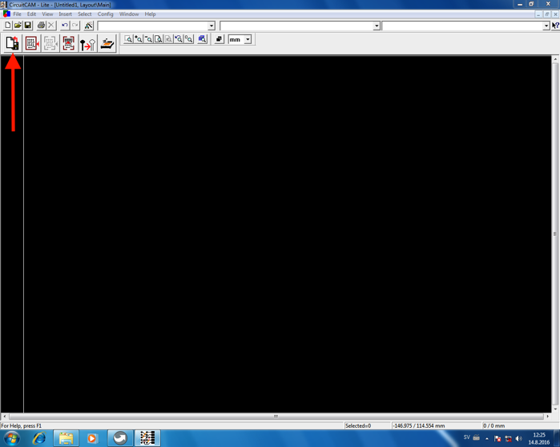

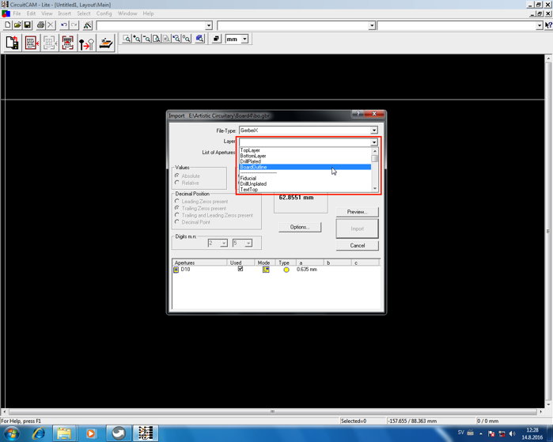

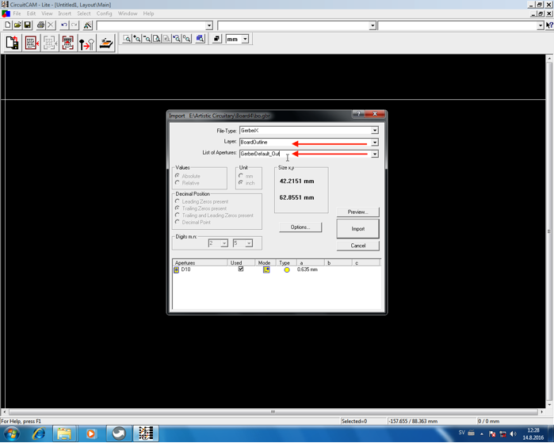

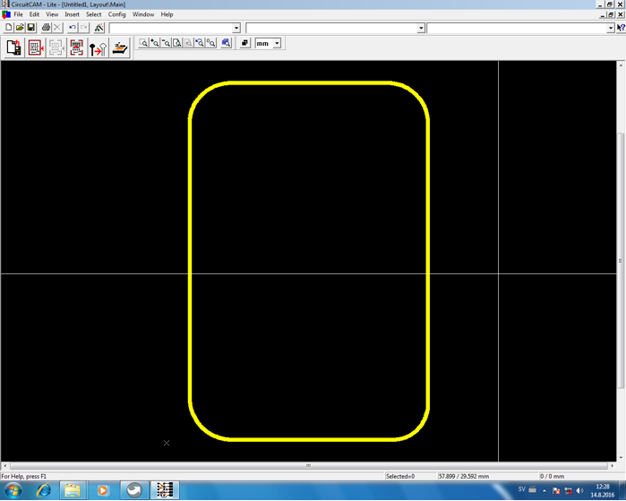

## 2.   Importing the Bottom Layer

1. Again Click on the same import menu to open the import dialogue and select the Gerber file for the Bottom layer.
2. Select the “Bottom layer” layer and Rename the aperture to “Bottom layer”
3. Click on Import.
4. The Bottom Layer should appear in green color corresponding to the one created in your layout.

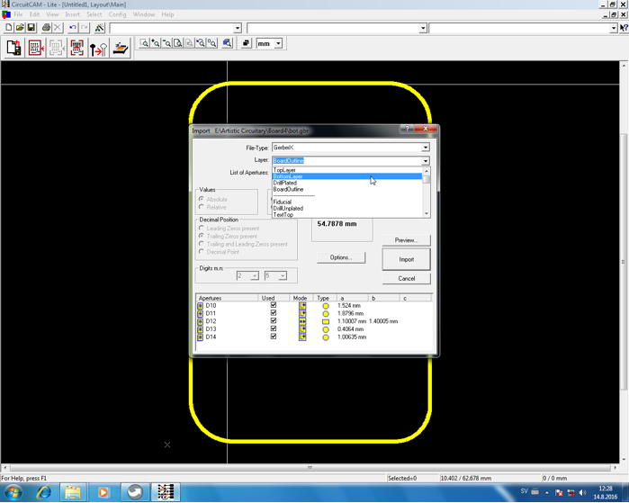

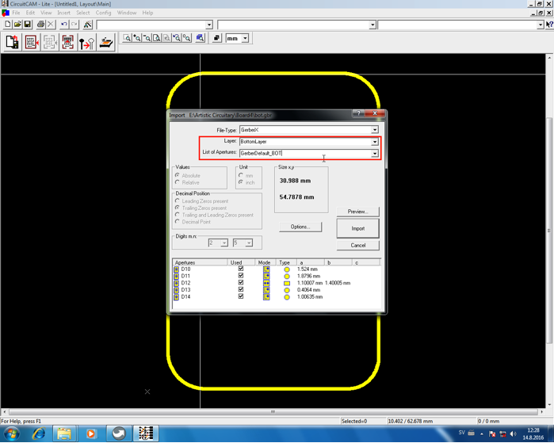

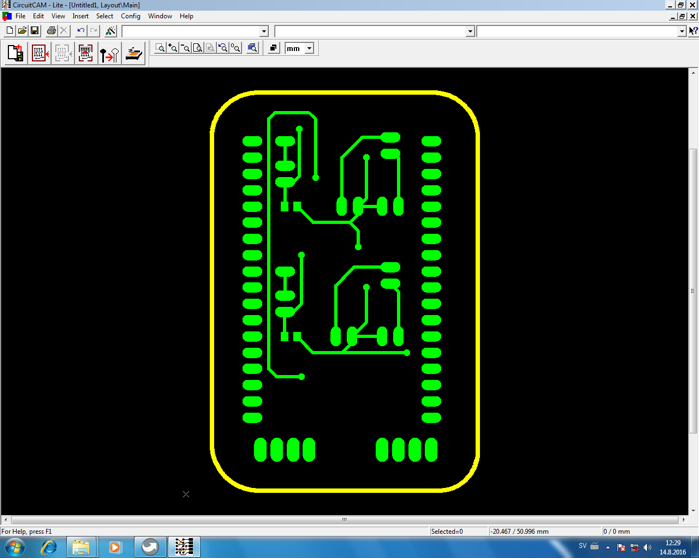

## 3.   Importing the Top Layer

1. Again Click on the same import menu to open the import dialogue and select the Gerber file for the Top layer.
2. Select the “Top Layer” layer and Rename the aperture to “Top Layer”
3. Click on Import.
4. The Top layer should appear in Red color corresponding to the one created in your layout.

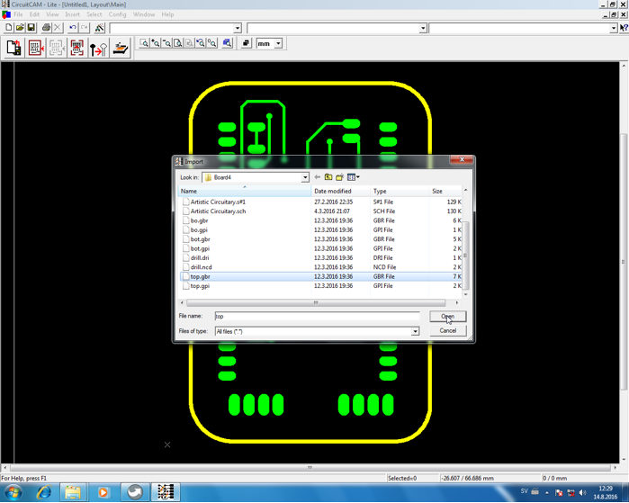

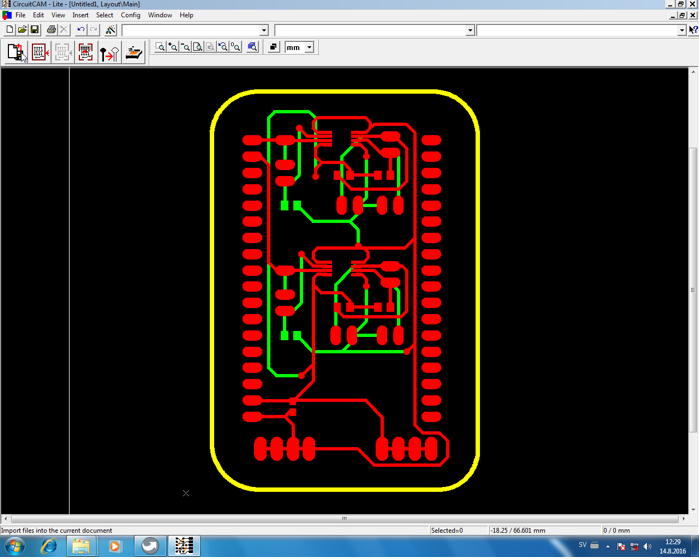

## 4.   Importing the Drill Layer

1. Again Click on the same import menu to open the import dialogue and select the Gerber file for the Drill Layer.
2. Select the “Drill Plated” layer and rename the Aperture to “Drill”.
3. In the *Digits m,n* section, there is a hit and trial method in this part. Most of the gerbers created from Eagle work well with a setting of 2,5. However if the drill holes are not imported to the scale, you can simply undo this and try with another pair of numbers (example 2,4 or 2,6).
4. Click on Import.
5. The Drill layer should appear in Blue corresponding to all the holes created in your layout.

Now you should be able to see the complete layout as made in the PCB Designing tool. Now the actual work begins.

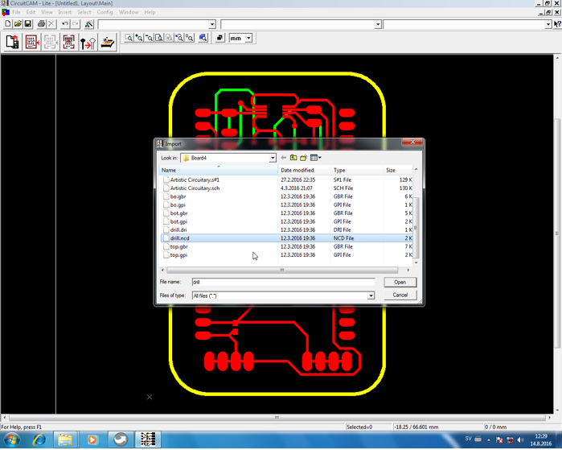

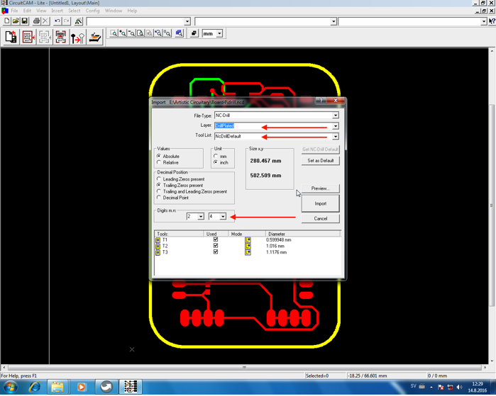

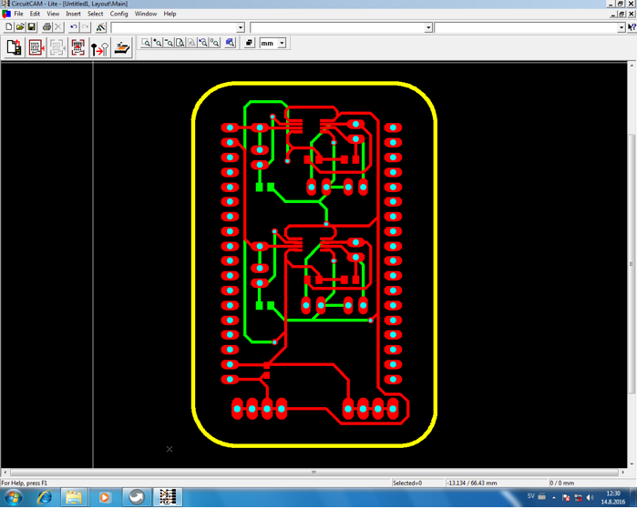

## 5.   Contour Routing the Board Outline

> **What is Contour Routing?**
>
> Contour routing is the process of cutting the outer edge of  a milled Printed Circuit Board from the glass epoxy laminate sheet. This contouring can be done in any shape as needed by the designer and is defined as the “Board Outline”.

In order to have a clutter free workspace, we will keep only those layers visible that we’re working with.
To make layers visible/Invisible click on the button as illustrated by the blue arrow in the screenshot, this will open the menu for changing the layer visibility.

Uncheck all the checkboxes inside the Red Box except the ones marked by orange arrows, we will just keep the Board Outline layer visible to perform contour routing as shown in the screenshot below.

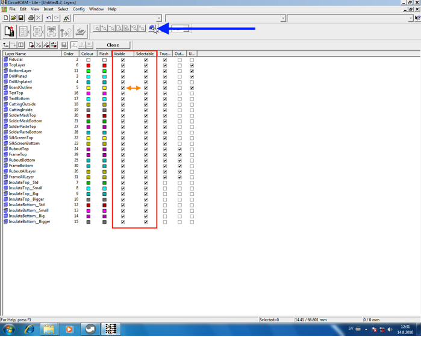

The final selection should look like Screenshot below.

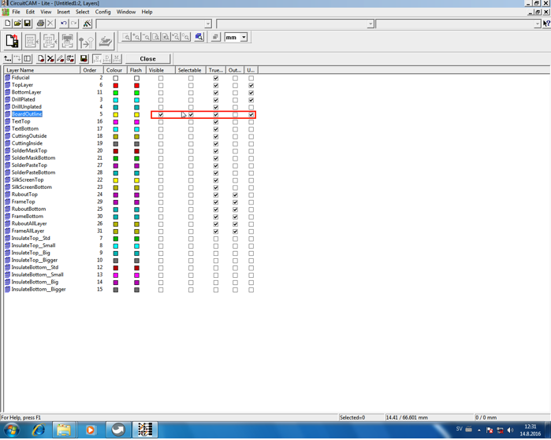

Now click at the Icon indicated by the Green Arrow in the Screenshot below. This should pop up the menu as shown in the Screenshot, Make the selections as shown in the Screenshot and Click on Run. Now this will create a new Layer for the contoured outline. However, you cannot see this layer, as all the layers were made invisible in previous step. So now, we’ll go back to the Layer Visibility menu and make this new layer visible.

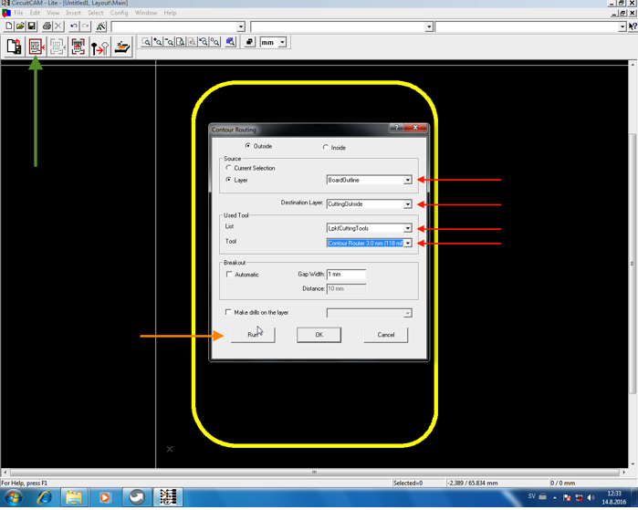

The contour layer comes up on the CuttingOutside Layer, a tick in the Checkbox in Used column indicates that the previous step was successful, Now make this layer Visible and Selectable.

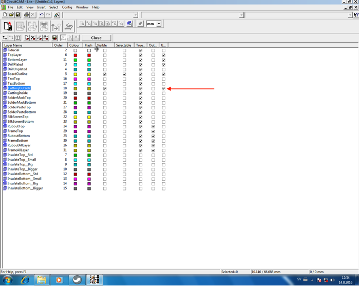

Now next step is to insert the breakout gaps on this layer, we usually if the boards are not too big, two gaps are enough. The reason of putting these gaps is to have a stable board, this is quite similar to the way SIM cards are hinged by small pieces of plastic which can be easily broken to take out the SIM card. If we don’t have these breakout gaps, the contouring drill will start cutting the board from one end and by the time it reaches other end, the board would be unstable.

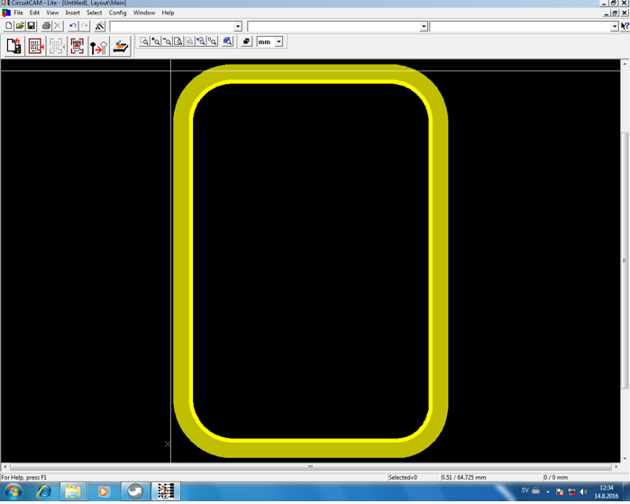

For inserting breakout gaps, select the middle of top edge (Indicated by arrow 1), then click on the button (indicated by arrow 2), Now select the Lower edge (arrow 3) and again click the button (arrow 2). Now there should be breakout gaps.

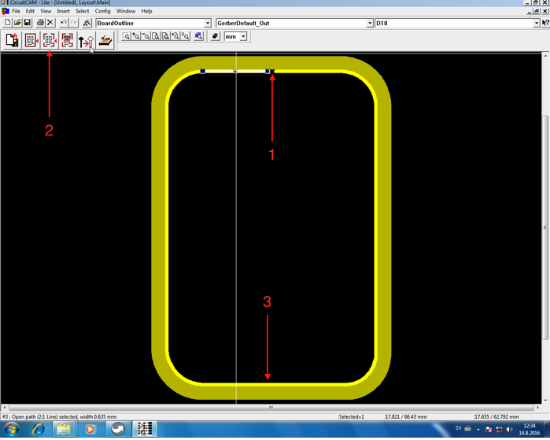

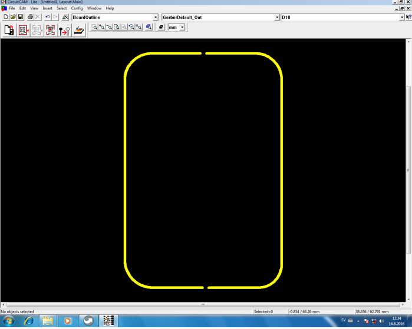

## 6. Insulating Top and Bottom Layer

> **Why is insulation done?**
>
> To understand this, let’s look at how connections are created on printed circuit board in the mechanical milling method.
>
> Printed circuit boards are created on Glass Fiber Epoxy laminates which have a layer of copper on either one or both sides. To create circuit paths, the copper wire is insulated by a milling drill, it can be seen in the image below, the shiny part is copper and the dark part is the insulated path. And hence they are independent wires/paths connecting one point to each other where components are soldered.
>
> Hence in the cam tool, we need to create insulations for our tracks and pass them to the milling machine.
>
> 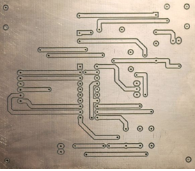

So the next step is to insulate Top and bottom layer. For this we will first make the Top layer visible & selectable.
Now go to Edit à Insulate

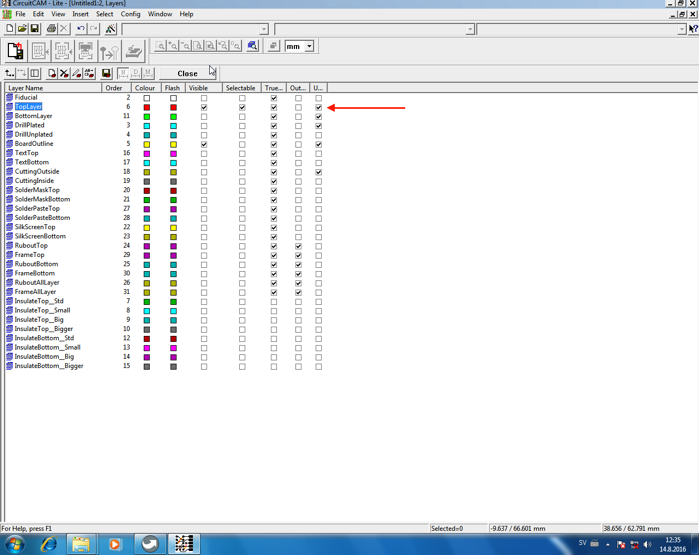

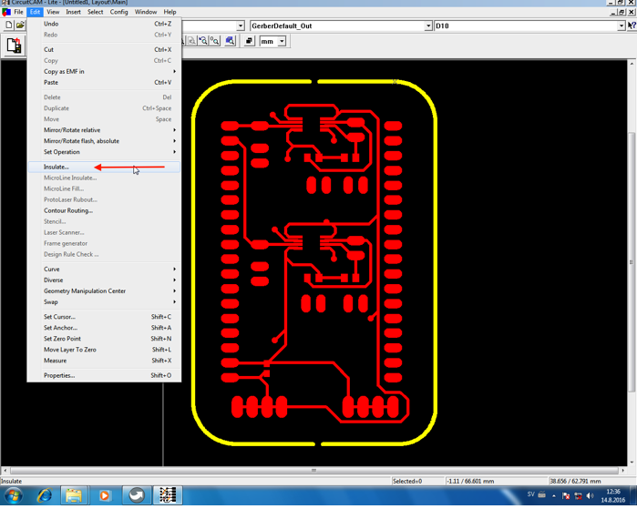

Now select the Top Layer, the output layer would be “InsulateDefaultTop” and the tool used would be the standard 8mil cutter. Click on Run.

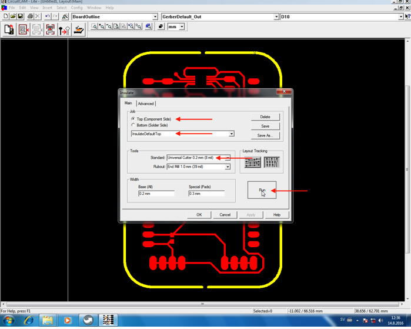

Now the insulated area can be seen on the InsulateTop_Std layer, it is highlighted in green color, and could be clearly seen if you make the top layer invisible.

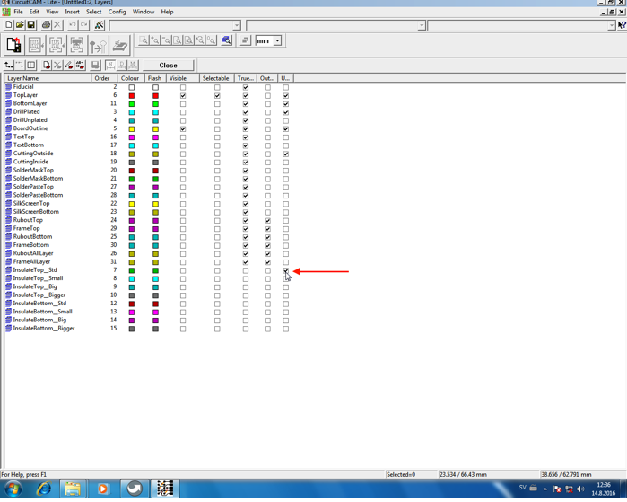

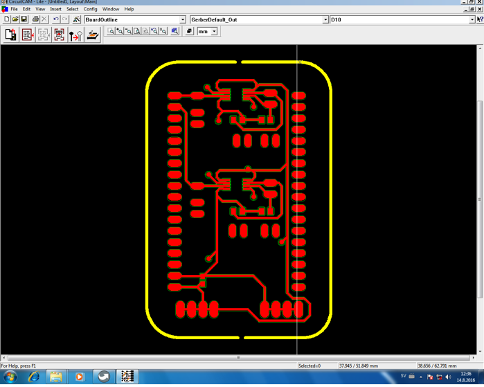

Now we will run the same process for Bottom layer, this time the layer would be InsulateDefaultBottom.

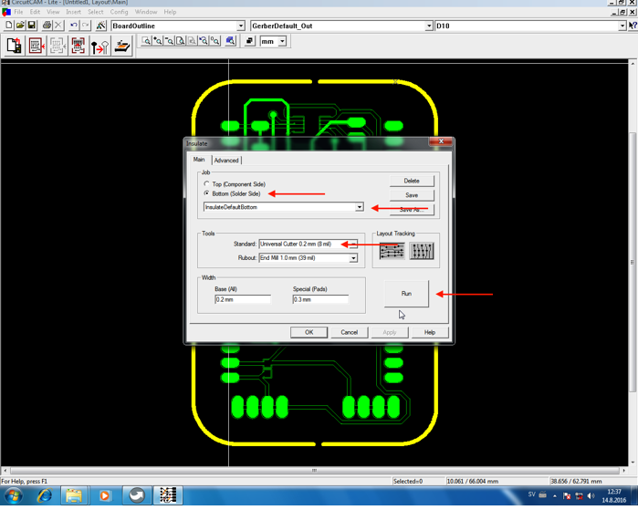

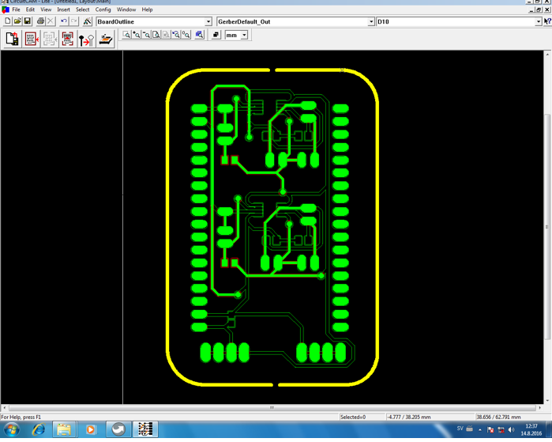

Now the final step, after both layers are insulated is to export this CAM file as a LMD file for the next stage. Which can be done by clicking the button show in in the screenshot below.

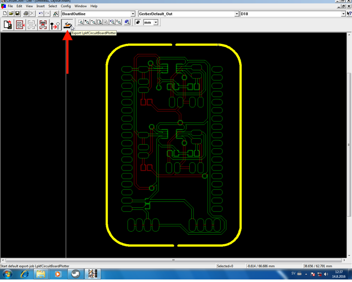

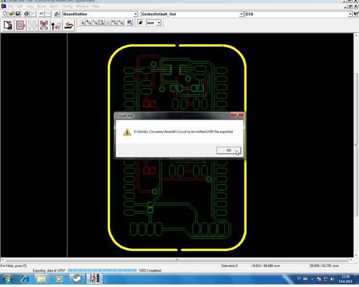

Now we can close CircuitCAM and move on to BoardMaster for the milling process.
